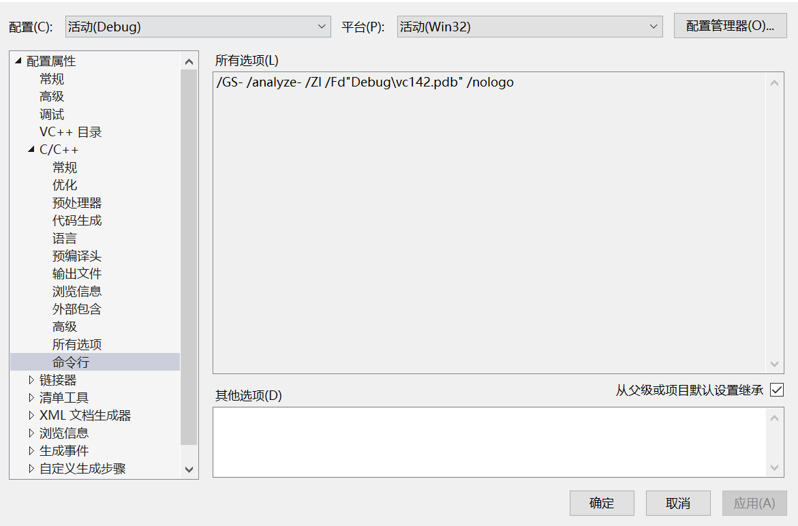
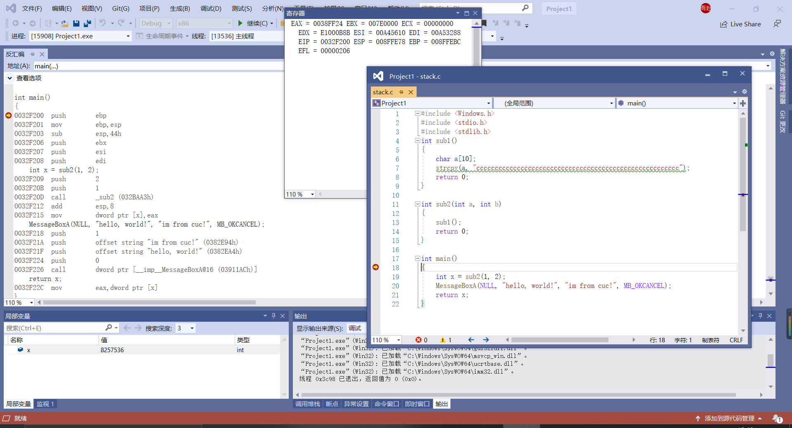

# 作业
1. 在vs中建立工程，修改编译选项，只保留 /ZI （调试）和pdb文件路径两个选项，增加禁用安全检查选项（/GS-)。

2. 编译多个函数调用的示例代码。
3. 下断点调试运行，观察反汇编、寄存器、内存等几个调试时的信息。
    
    - 将断点放在第一行int main下
4. 分析函数调用过程中栈的变化。解释什么是栈帧？ebp寄存器在函数调用过程中的变化过程，ebp寄存器的作用。
    - 调用过程中栈的变化
        - ebp入栈，使用 EBP 来存取堆栈，以保存之前任务的信息
        - 将栈顶指针的值赋给EBP，将之前的栈顶作为新的基址（栈底）
        - 再这个基址上开辟相应的空间用作被调用函数的堆栈。
        - 将ebx，esi，edi，1，2压入堆栈
        - call调用函数sub2
        - （esp）+8后的结果送esp，也就是堆栈的指针向高地址方向移动，因此相当于pop操作后的指针变化
        - 将eax中的值给dword ptr [x]
        - 将1，string，0压入堆栈
        - call调用函数MessageBoxA
        - 将dword ptr [x]中的值给eax
        - 将edi，esi，ebx出栈
        - 将栈顶esp指针的值赋给EBP，将之前的栈顶作为新的基址（栈底）
        - 将ebp出栈
    - 栈帧：C语言中，每个栈帧对应着一个未运行完的函数。栈帧中保存了该函数的返回地址和局部变量。
    - ebp(extended base pointer)寄存器存放当前栈帧的栈底，一般在函数内不会对ebp寄存器做变动；   
      esp(extended stack pointer)寄存器存放当前栈帧的栈顶，会随着当前函数内栈空间的开辟而变动；     
      ebx常用于存档内存地址；       
      esi通常用于存放要处理的数据内存地址；     
      edi通常存放处理后的数据内存地址；     
      eax常用于算术运算、布尔操作、逻辑操作、返回函数等
    - ebp只是存取某时刻的esp，这个时刻就是进入一个函数内后，cpu会将esp的值赋给ebp，此时就可以通过ebp对栈进行操作，比如获取函数参数，局部变量等，实际上使用esp也可以
5. 函数局部变量和参数的保存位置、访问方式是什么。
    - 局部变量存储位置：自动保存在函数的每次执行的栈帧中，并随着函数结束后自动释放，另外，函数每次执行则保存在栈中
    - 参数保存在栈中
    - 通过esp指针进行访问
6. 多层的函数调用，栈的变化情况，解释未赋初始值的局部变量的值是如何形成的。
    - 内存中该地址已有的值
